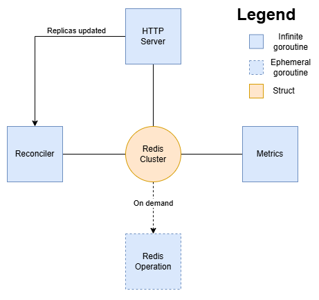

<!--
SPDX-FileCopyrightText: 2025 INDUSTRIA DE DISEÑO TEXTIL S.A. (INDITEX S.A.)

SPDX-License-Identifier: Apache-2.0
-->

# Robin architecture

This page provides an overview of Robin's internal architecture, showing its internal components, how they interact with each other and how Robin manages the RedKey cluster.

## Components

There are four main components in Robin:

- **HTTP Server**: server that handles the API calls. It is implemented in `internal/httpserver` package and used by controller-manager to expose Robin endpoints.
- **Reconciler**: agent that is reponsible for reconciling the RedKey Cluster  in its different states. It is implemented in `internal/reconciler` package and launched as a goroutine.
- **Metrics**: agent that is responsible for gathering the RedKey Cluster  metrics and including them in a Prometheus format for controller-manager. It is implemented in `internal/metrics` package and launched as a goroutine (can be disabled).
- **RedKey Cluster**: object that represents a RedKey Cluster and that contains the operations that can be done within the cluster. It is implemented in `internal/cluster`, created on boot and used by the rest components.

## Architecture

The following image shows the architecture of RedKey Robin:

## Redis Operations

In order to have knowledge about what is being executed on the RedKey Cluster , Robin introduces the concept of Redis Operations. A Redis Operation is an action or a set of actions that run in one or several RedKey cluster nodes to create, modify, check or delete the cluster. 

Robin uses Redis Operations to avoid executing twice the same action on the RedKey Cluster  at the same time (for example reseting a node) and to avoid incompatible actions at the same time (for example rebalancing the cluster and resharding a node).

A Redis Operation is represented by the RedisOperation struct (package `internal/cluster`). This struct contains the information about the operation: the name, status, when it started, when it finished (if already finished), the nodes involved (if any) and the Redis command to run. For the latter, we define the interface RedisCommand, which represents the actions that run on the clusters. There are two RedisComand implementations:

- RedisCLICommand: runs a `redis-cli --cluster` command on the RedKey Cluster .
- RedisLibraryCommand: runs programmatic actions on the RedKey Cluster  using the `github.com/redis/go-redis/v9` library and, optionally, redis-cli command using a RedisCLICommand.

> [!WARNING] 
> The `redis-cli --cluster` command requires that all nodes in the cluster are up and reachable. If any node is down, the command may fail or produce no results.

The Redis Operations implemented in Robin are:

- Rebalance: it uses a RedisCLICommand to run a `redis-cli --cluster rebalance` command.
- Move Slots: it uses a RedisCLICommand to run a `redis-cli --cluster reshard` command on two specific redis nodes.
- Fix: it uses a RedisCLICommand to run a `redis-cli --cluster fix` command.
- Check integrity: it uses a RedisLibraryCommand to check the integrity of the cluster. In particular, if needed, it removes outdated nodes, meets the nodes, ensures the cluster ratio, assigns missing slots, fixes the cluster (Fix operation) and rebalances the cluster (Rebalance operation).
- Scale Up: it uses a RedisLibraryCommand to scale up the cluster. In particular, if needed, it adds new nodes to the cluster and runs a check integrity to assure the cluster is well formed and balanced.
- Scale Down: it uses a RedisLIbraryCommand to scale down the cluster. In particular, if needed, it removes nodes from the cluster and runs a check integrity to assure the cluster is well formed and balanced.
- Upgrade: it uses a RedisLibraryCommand to upgrade the cluster. In particular, if needed, it adds new nodes to the cluster, removes outdated nodes, meets the nodes, ensures the cluter ratio and assigns missign slots. Note that the nodes upgrade is orchestrated by an external Operator (the RedKey Operator), Robin only ensures that the cluster is well formed and performs the operations requested by the Operator using Robin's API.
- Reset Node: it uses a RedisLibraryCommand to reset a node. In particular, it reset the node, it forgets the node in the cluster if the cluster is ephemeral, it removes oudated nodes, meet the nodes and ensure cluster ratio.

